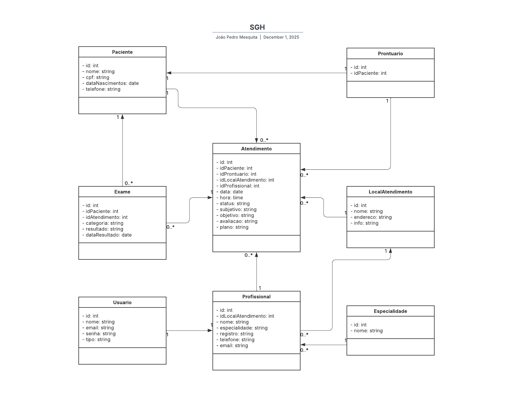
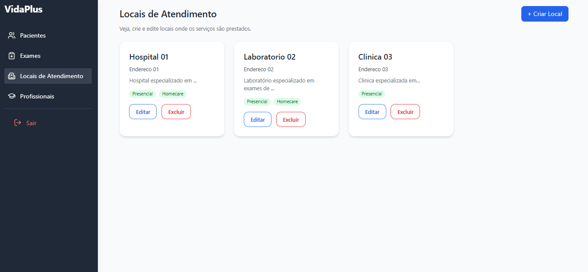
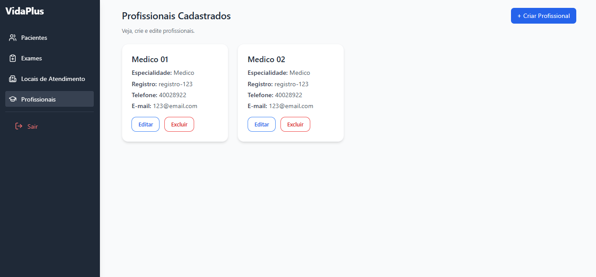
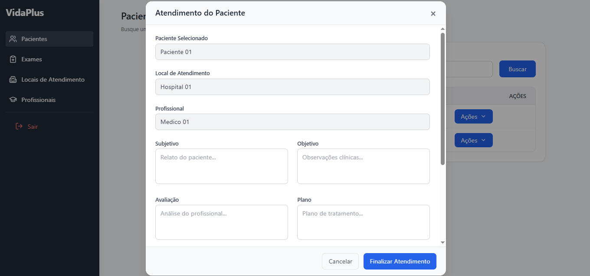
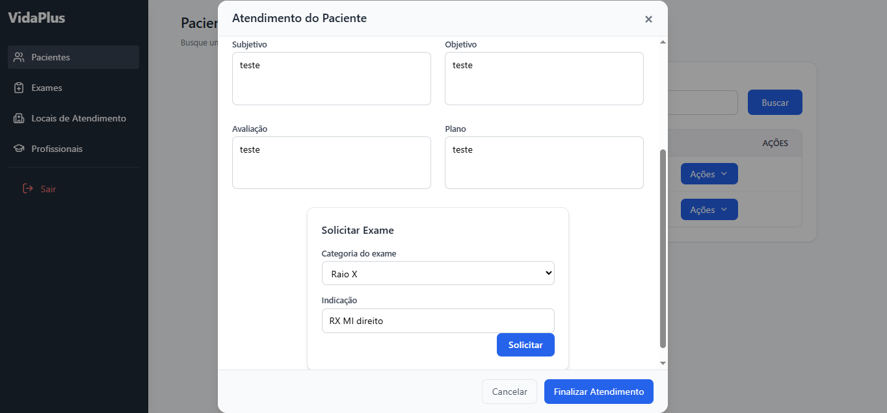
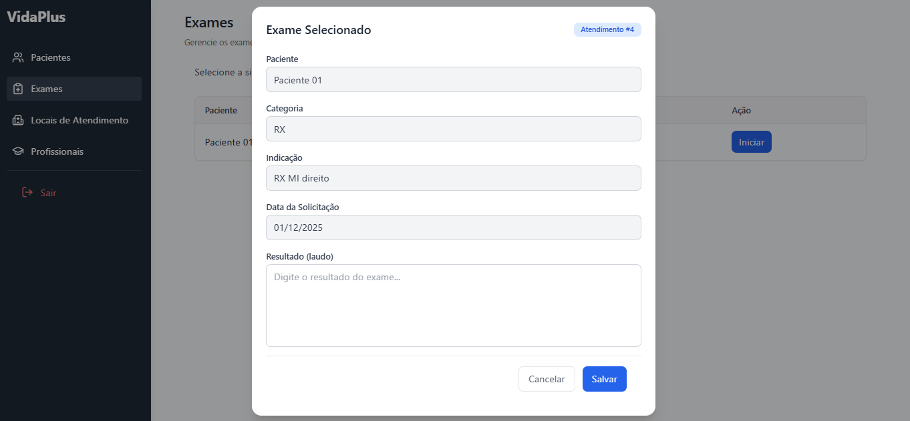
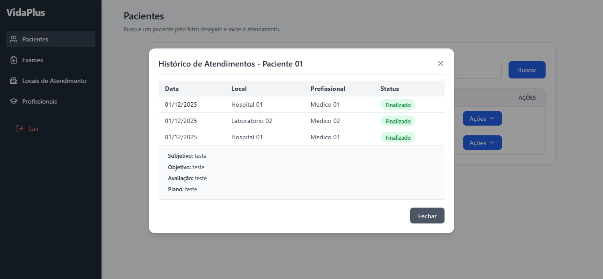

# Introdução

Nos últimos anos, clínicas, consultórios e hospitais têm buscado
otimizar seus processos internos para melhorar a eficiência operacional
e a qualidade no atendimento ao paciente. Nesse contexto, este estudo de
caso apresenta o desenvolvimento de um Sistema de Gerenciamento
Hospitalar (SGH), projetado para centralizar informações, reduzir falhas
humanas, agilizar fluxos de trabalho e oferecer suporte à tomada de
decisões clínicas e administrativas.

O objetivo principal do projeto é criar um sistema completo e integrado,
capaz de gerenciar pacientes, profissionais de saúde, exames, prontuários eletrônicos e fluxos internos da instituição. O
sistema foi desenvolvido utilizando tecnologias modernas de front-end e
back-end, com ênfase em segurança, escalabilidade e usabilidade.

Os principais usuários do sistema são:

-   **Recepcionistas**: responsáveis por cadastrar pacientes, agendar
    consultas e organizar fluxos de atendimento.
-   **Médicos**: acessam prontuários, registram diagnósticos, solicitam
    exames e visualizam histórico clínico.
-   **Enfermeiros**: realizam triagens, monitoram dados vitais e inserem
    informações assistenciais.
-   **Administradores**: gerenciam usuários, permissões, unidades de
    atendimento, profissionais, relatórios e indicadores do sistema.

A relevância do SGH está na sua capacidade de integrar setores,
automatizar processos repetitivos, evitar perdas de informações e
garantir maior segurança e rastreabilidade dos dados clínicos.

# Tecnologias Usadas

Aqui estão as principais tecnologias e ferramentas utilizadas neste projeto:

## Frontend

- React.js
- React Router
- Tailwind CSS

## Backend

- Node.js
- Express.js
- JWT (JSON Web Token)
- Middleware de Autenticação
- Bcrypt

## Banco de Dados

- MongoDB
- Sequelize

## Ferramentas e Utilidades

- Git & GitHub
- Postman para testes de API
- Dotenv para variáveis de ambiente

# Análise e Requisitos

## Requisitos Funcionais (RF)

-   **RF01 -- Gerenciar pacientes:** cadastrar, editar e consultar
    informações.
-   **RF02 -- Gerenciar prontuário eletrônico:** registrar informações
    clínicas, diagnósticos, prescrições e exames.
-   **RF03 -- Solicitar e registrar exames:** registrar solicitações,
    resultados e status.
-   **RF04 -- Controle de acesso por permissão:** restringir
    funcionalidades por papel.
-   **RF05 -- Histórico de atendimentos:** armazenar todas as consultas
    realizadas.

## Requisitos Não Funcionais (RNF)

-   **RNF01 -- Segurança:** autenticação JWT, criptografia e controle de
    acesso.
-   **RNF02 -- Usabilidade:** interface simples, intuitiva e
    responsiva.
-   **RNF03 -- Escalabilidade:** arquitetura preparada para múltiplas
    unidades.
-   **RNF04 -- Disponibilidade:** funcionamento 24/7 e tolerância a
    falhas.
-   **RNF05 -- Integridade dos dados:** consistência e proteção contra
    alterações indevidas.
-   **RNF06 -- Compatibilidade:** funcionamento nos principais
    navegadores.
-   **RNF07 -- Manutenção:** boas práticas e separação de
    responsabilidades.

# Modelagem e Arquitetura

Na imagem abaixo é possível ver o diagrama UML:

# Implementação

O projeto foi desenvolvido com um conjunto de módulos bem definidos,
envolvendo:

-   modelos,
-   rotas,
-   controladores,
-   componentes,
-   hooks,
-   banco de dados,
-   e outras camadas da aplicação.

Usuários para teste:

-   **email:** role | **senha:** 123456 
-   **email:** medico01 | **senha:** 123456 
-   **email:** medico02 | **senha:** 123456

Segue abaixo alguns prints tirados do sistema:

- Perfil Admin: 

- Perfil Admin: 

- Perfil Admin: 

- Perfil Médico: 

- Perfil Admin: 

- Perfil Tecnico: 

- Perfil Médico: 

# Planos de Teste (Backend)

### Autenticação e Autorização

-   Testar login com credenciais válidas.
-   Rejeitar tokens inválidos ou expirados.
-   Garantir controle de acesso por roles.
-   Garantir que apenas médicos acessem prontuários.

### CRUD de Usuários, Pacientes e Profissionais

-   Criar, editar, listar e excluir registros.
-   Validar integridade e códigos de resposta da API.

## Como instalar e executar o projeto

### 1. Clone este repositório

    git clone https://github.com/JoaoPedroMesquitaRS/vida-plus

### 2. Acesse o diretório

    cd vida-plus

------------------------------------------------------------------------

## 📦 Instalação das dependências

### Frontend

    npm install

### Backend

    cd backend
    npm install

------------------------------------------------------------------------

## Executando

### Frontend

    npm run dev

### Backend

    cd backend
    npx nodemon index.js

Backend em:

    http://localhost:3001

------------------------------------------------------------------------

# Conclusão

O desenvolvimento do SGH permitiu aplicar conhecimentos técnicos em um
cenário realista e complexo. Entre as principais lições aprendidas,
destaca-se a importância de:

-   uma arquitetura modular,
-   segurança e autenticação bem estruturadas,
-   boas práticas de desenvolvimento.

**Desafios:** controle de acesso por papéis e organização do fluxo
clínico.

**Pontos para evoluções futuras:**

-   Integração com APIs externas (laboratórios, faturamento).
-   Testes automatizados e monitoração contínua.
-   Dashboards analíticos e indicadores.
-   Suporte a múltiplas unidades.

O projeto demonstra que é possível construir uma solução sólida, segura
e escalável, com espaço claro para expansão futura.